# Taller de Modularización con Virtualización e Introducción a Docker

## Descripción

En este taller se profundizaron los conceptos de modularización por medio de virtualización usando **Docker** y **AWS**. Se construyó una aplicación web con Spring Boot, se empaquetó en un contenedor Docker, se subió a Docker Hub y se desplegó en una máquina virtual EC2 en AWS.

---

## Tecnologías utilizadas

- Java 17
- Spring Boot 3.3.3
- Maven
- Docker Desktop
- Docker Hub
- AWS EC2 (Amazon Linux 2023)

---

## Arquitectura

```
Navegador
    │
    ▼
EC2 (AWS) puerto 42000
    │
    ▼
Contenedor Docker (taller-docker)
    │
    ▼
Spring Boot App (puerto 6000 interno)
    │
    ▼
GET /greeting?name=World → "Hello, World!"
```

---


## Parte 1: Aplicación Spring Boot

Se creó una aplicación Spring Boot mínima con un controlador REST que responde saludos:

```java
@RestController
public class HelloRestController {
    private static final String template = "Hello, %s!";

    @GetMapping("/greeting")
    public String greeting(@RequestParam(value = "name", defaultValue = "World") String name) {
        return String.format(template, name);
    }
}
```

La aplicación lee el puerto de la variable de entorno `PORT`, con valor por defecto `5000`.

### Compilación

```bash
mvn clean install
```

### Ejecución local

```bash
java -cp "target/classes;target/dependency/*" co.edu.escuelaing.RestServiceApplication
```

---

## Parte 2: Docker

### Dockerfile

```dockerfile
FROM eclipse-temurin:17
WORKDIR /usrapp/bin
ENV PORT 6000
COPY /target/classes /usrapp/bin/classes
COPY /target/dependency /usrapp/bin/dependency
CMD ["java","-cp","./classes:./dependency/*","co.edu.escuelaing.RestServiceApplication"]
```

### Construir la imagen

```bash
docker build --tag taller-docker .
```

### Crear 3 contenedores independientes

```bash
docker run -d -p 34000:6000 --name container1 taller-docker
docker run -d -p 34001:6000 --name container2 taller-docker
docker run -d -p 34002:6000 --name container3 taller-docker
```

### Verificar contenedores corriendo

```bash
docker ps
```

### Acceder desde el navegador

```
http://localhost:34000/greeting
http://localhost:34001/greeting
http://localhost:34002/greeting
```

---

## Parte 3: Docker Hub

### Autenticarse

```bash
docker login
```

### Etiquetar la imagen

```bash
docker tag taller-docker julirod03/taller-docker
```

### Subir la imagen

```bash
docker push julirod03/taller-docker:latest
```

Repositorio en Docker Hub: [julirod03/taller-docker](https://hub.docker.com/r/julirod03/taller-docker)

---

## Parte 4: Despliegue en AWS EC2

### Conexión a la instancia

```bash
ssh -i "AppServer.pem" ec2-user@ec2-3-91-105-135.compute-1.amazonaws.com
```

### Instalación de Docker en Amazon Linux 2023

```bash
sudo yum update -y
sudo yum install docker -y
sudo service docker start
sudo usermod -a -G docker ec2-user
```

### Despliegue del contenedor desde Docker Hub

```bash
docker run -d -p 42000:6000 --name tallerdocker julirod03/taller-docker
```

### Verificar

```bash
docker ps
```

### Abrir el puerto en el Security Group de AWS

Se abrió el puerto **42000** con origen `0.0.0.0/0` en las reglas de entrada del Security Group de la instancia EC2.

### Acceder desde internet

```
http://ec2-3-91-105-135.compute-1.amazonaws.com:42000/greeting
```

---

## Evidencias

### Aplicación corriendo localmente

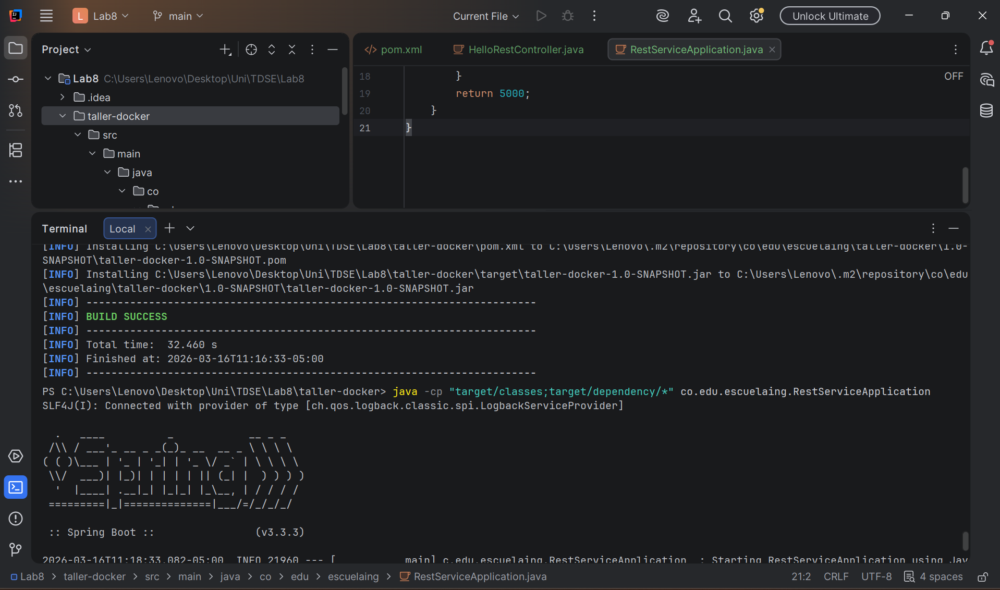

### Hello World en localhost

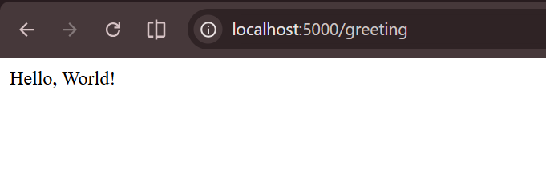

### Greeting con nombre

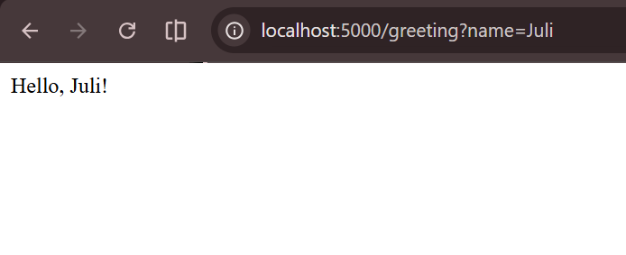

### Contenedores Docker corriendo localmente

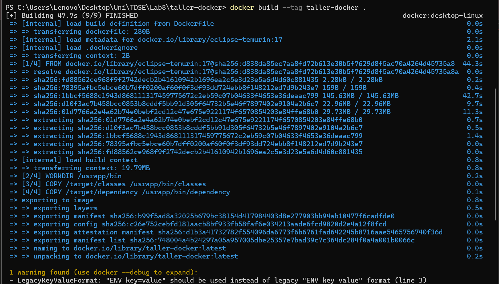

### Docker Desktop con contenedores activos

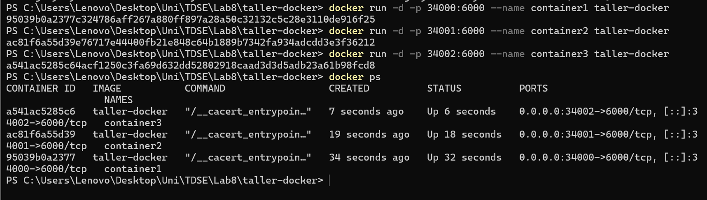

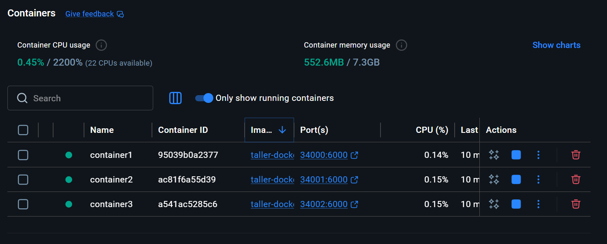

### Login y push a Docker Hub

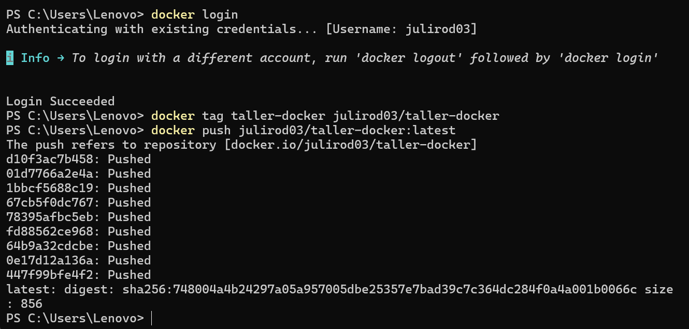

### Repositorio en Docker Hub

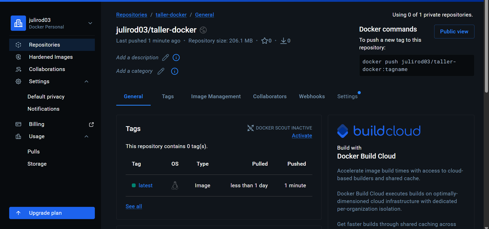

### Conexión SSH a EC2

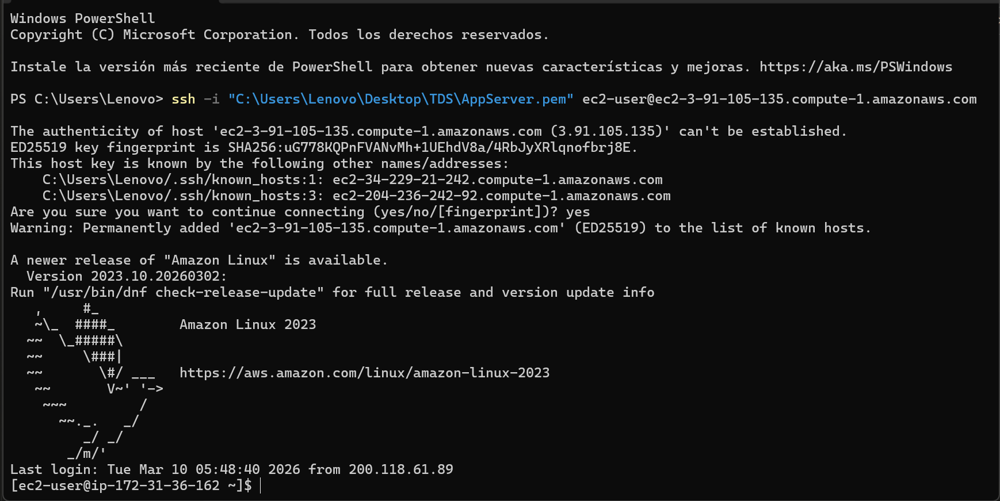

### Instalación de Docker en EC2

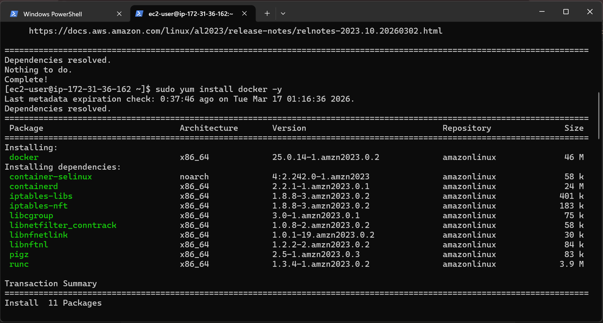

### Aplicación corriendo en AWS

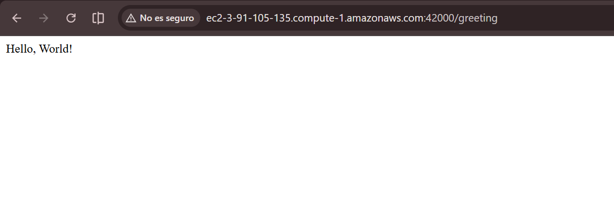
